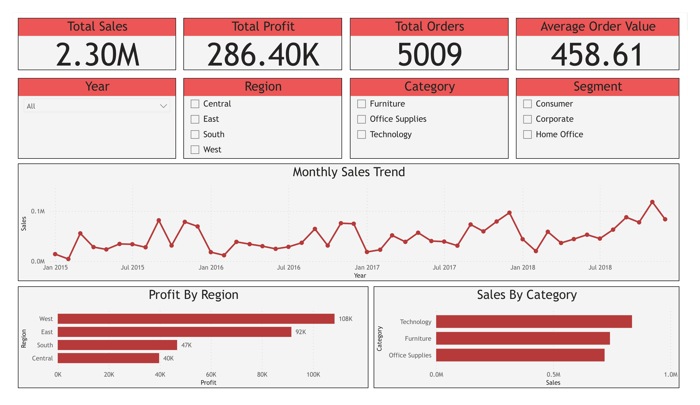
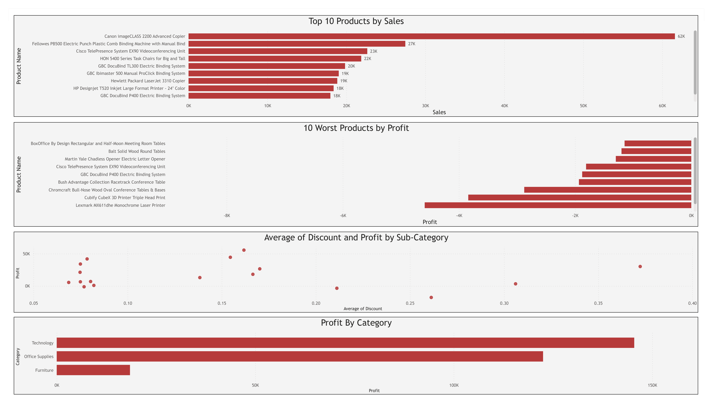
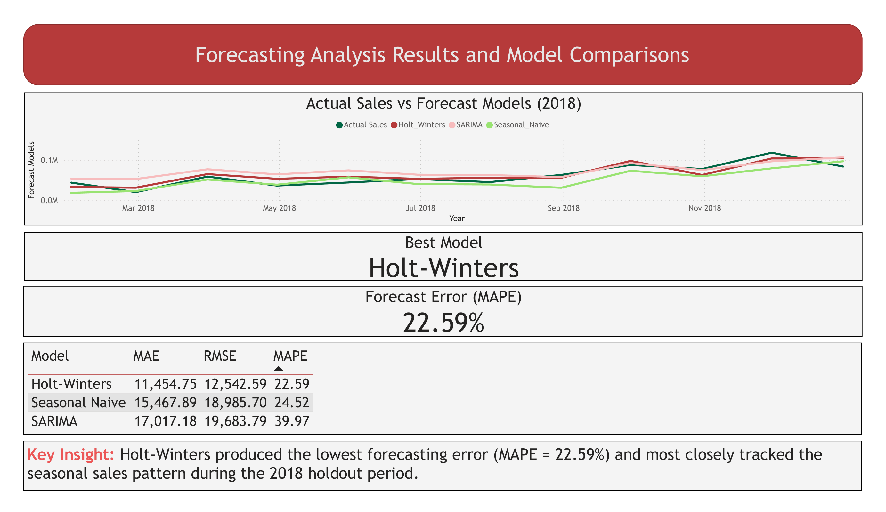
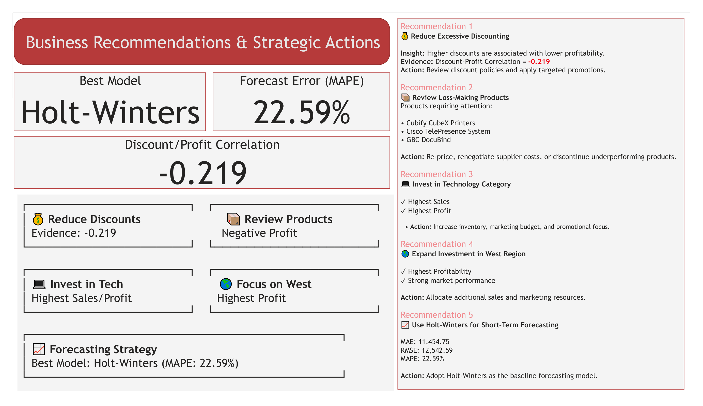

# Sales Forecasting & Business Intelligence Dashboard

## Project Overview

This project analyzes historical retail sales data from the Superstore dataset to uncover business insights, evaluate forecasting models, and develop strategic recommendations. The analysis combines Python, SQL, and Power BI to create an end-to-end business intelligence solution.

The project focuses on:

* Sales and profitability analysis
* Product performance evaluation
* Regional performance assessment
* Sales forecasting
* Business recommendations supported by data

---

## Tools & Technologies

### Programming & Analysis

* Python
* Pandas
* NumPy
* Matplotlib
* Statsmodels
* Scikit-learn

### Data Querying

* SQL (SQLite)

### Visualization

* Power BI

### Development Environment

* VS Code
* Jupyter Notebook
* Git & GitHub

---

## Dataset

**Dataset:** Superstore Sales Dataset

The dataset contains retail transaction records including:

* Orders
* Customers
* Products
* Categories
* Regions
* Sales
* Profit
* Discounts

### Time Period

2015 – 2018

---

## Business Objectives

The primary objectives of this project were:

1. Analyze historical sales performance.
2. Identify top-performing and underperforming products.
3. Evaluate regional profitability.
4. Assess the impact of discounting on profit.
5. Forecast future sales using multiple forecasting models.
6. Recommend actionable business strategies.

---

## Project Workflow

Data Collection

↓

Data Cleaning & Preparation

↓

Exploratory Data Analysis (EDA)

↓

Time Series Forecasting

↓

SQL Business Analysis

↓

Power BI Dashboard Development

↓

Business Recommendations

---

## Forecasting Models Evaluated

Three forecasting approaches were tested and compared.

| Model          |       MAE |      RMSE |  MAPE |
| -------------- | --------: | --------: | ----: |
| Holt-Winters   | 11,454.75 | 12,542.59 | 22.59 |
| Seasonal Naive | 15,467.89 | 18,985.70 | 24.52 |
| SARIMA         | 17,017.18 | 19,683.79 | 39.97 |

### Best Forecasting Model

**Holt-Winters**

Reason:

* Lowest MAE
* Lowest RMSE
* Lowest MAPE (22.59%)

The Holt-Winters model provided the most accurate short-term sales forecasts among the evaluated models.

---

## SQL Analysis

SQL was used to generate business KPIs and forecasting metrics.

Included SQL analyses:

* Sales KPIs
* Time-series trend analysis
* Forecast model comparison
* Forecasting performance metrics

SQL files:

* sales_kpis.sql
* time_series_queries.sql
* forecasting_metrics.sql

---

## Power BI Dashboard

The dashboard contains four interactive pages.

### 1. Executive Overview

Provides a high-level summary of business performance.

Includes:

* Total Sales
* Total Profit
* Total Orders
* Average Order Value
* Sales Trend
* Category Performance
* Regional Profitability

### 2. Product Performance

Analyzes product-level performance.

Includes:

* Top-Selling Products
* Loss-Making Products
* Discount vs Profit Analysis
* Category Profit Distribution

### 3. Forecasting Analysis

Compares forecasting models and forecast performance.

Includes:

* Forecast Comparison
* Model Evaluation Metrics
* Best Model Selection
* Forecast Error Analysis

### 4. Business Recommendations

Summarizes key business actions derived from the analysis.

---

## Key Findings

### 1. Technology Category Leads Performance

Technology generated:

* Highest Sales
* Highest Profit

### 2. West Region Is Most Profitable

The West region consistently produced the strongest profitability performance.

### 3. Discounting Reduces Profitability

Discount-Profit Correlation:

-0.219

Higher discount levels were associated with lower profitability.

### 4. Several Products Generate Negative Profit

Products such as:

* Cubify CubeX Printers
* Cisco TelePresence System
* GBC DocuBind

generated strong sales volume but negative profit.

### 5. Holt-Winters Was the Best Forecasting Model

Holt-Winters achieved the lowest forecasting error among all tested models.

---

## Business Recommendations

### Recommendation 1

Reduce excessive discounting.

Evidence:

Negative Discount-Profit Correlation (-0.219).

### Recommendation 2

Review and optimize loss-making products.

Potential actions:

* Re-pricing
* Supplier renegotiation
* Product discontinuation

### Recommendation 3

Increase investment in Technology products.

Reason:

Highest sales and profit contribution.

### Recommendation 4

Expand investment in the West region.

Reason:

Highest regional profitability.

### Recommendation 5

Adopt Holt-Winters as the baseline forecasting model.

Reason:

Lowest forecasting error (MAPE = 22.59%).

---

## Dashboard Screenshots

### Executive Dashboard

### Product Performance

### Forecasting Analysis

### Business Recommendations

---

## Future Improvements

Potential future enhancements include:

* Prophet forecasting model implementation
* Machine learning forecasting techniques
* Automated forecasting pipeline
* Dashboard deployment to cloud platforms
* Integration of external economic indicators

---

## Project Structure

Sales-Forecasting-Analysis/

├── dashboard/

│   ├── sales_forecasting_dashboard.pbix

│   └── images/

├── data/

│   ├── raw/

│   └── processed/

├── notebooks/

│   └── sales_forecasting_analysis.ipynb

├── sql/

│   ├── sales_kpis.sql

│   ├── time_series_queries.sql

│   └── forecasting_metrics.sql

└── README.md

---

## Author

Amirhossein Ashrafi

Data Analytics Portfolio Project